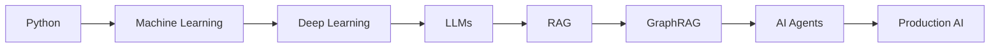

<div align="center">

# Hey, I'm Thrivanesar 👋

### AI / ML Developer · Building Intelligent Systems


<br/>

[](https://github.com/testgit-007)
[](YOUR_LINKEDIN_URL)
[](mailto:YOUR_EMAIL)

</div>

---

## ⚡ About Me

```python
class Developer:
    def __init__(self):
        self.name = "Thrivanesar"
        self.role = "AI / ML Developer"

        self.interests = [
            "Artificial Intelligence",
            "Machine Learning",
            "Large Language Models",
            "Retrieval-Augmented Generation",
            "GraphRAG",
            "Intelligent Systems"
        ]

        self.currently_building = "AI projects that solve real problems"
        self.goal = "Build. Learn. Ship. Repeat."

me = Developer()
```

I enjoy building **AI-powered applications** that go beyond notebooks and experiments.

My focus is on combining **machine learning, LLMs, retrieval systems, and software engineering** to create projects that are actually usable.

---

# 🧠 What I'm Building

<table>
<tr>
<td width="50%" valign="top">

### 🔗 GraphRAG Systems

Building intelligent retrieval pipelines using:

* Knowledge Graphs
* Semantic Search
* Vector Embeddings
* LLM Reasoning
* Context-aware Retrieval

`GraphRAG` `RAG` `LLM` `Embeddings`

</td>

<td width="50%" valign="top">

### 🤖 Generative AI

Exploring modern LLM application architectures:

* LangChain
* Prompt Engineering
* AI Agents
* RAG Pipelines
* Tool Calling
* Structured Outputs

`LangChain` `LLM` `GenAI` `Agents`

</td>
</tr>

<tr>
<td width="50%" valign="top">

### 📡 AI + IoT

Experimenting with ML systems connected to real-world sensor data.

* IoT Sensors
* Prediction Systems
* Anomaly Detection
* Edge Intelligence
* Smart Automation

`IoT` `Machine Learning` `Python`

</td>

<td width="50%" valign="top">

### 🧩 Machine Learning

Building strong foundations through end-to-end ML projects.

* Data Processing
* Feature Engineering
* Model Training
* Evaluation
* Deployment

`Scikit-learn` `Pandas` `NumPy`

</td>
</tr>
</table>

---

# 🚀 Featured Projects

| Project                              | What it does                                                                    | Tech                                 |
| :----------------------------------- | :------------------------------------------------------------------------------ | :----------------------------------- |
| 🧠 **GraphRAG Knowledge Assistant**  | Retrieves and reasons over connected knowledge using graph + semantic retrieval | Python · LLM · GraphRAG · Embeddings |
| 🔎 **RAG Question Answering System** | Answers questions using information retrieved from a custom knowledge base      | LangChain · Vector DB · LLM          |
| 📡 **IoT ML System**                 | Uses sensor data and ML for intelligent monitoring and prediction               | IoT · Python · ML                    |
| 🤖 **AI Agent Experiments**          | Experiments with tool-using autonomous LLM workflows                            | LangChain · Agents · APIs            |

> More projects are being built and shipped continuously.

---

# 🛠️ Tech Stack

### Languages

<p>

</p>

### AI / Machine Learning

<p>

</p>

`LangChain` · `LLMs` · `RAG` · `GraphRAG` · `Embeddings` · `Vector Databases`

### Data

<p>

</p>

`Pandas` · `NumPy` · `Data Analysis`

### Development

<p>

</p>

---

# ⚙️ Current Focus

```text
┌──────────────────────────────────────────────┐
│                                              │
│   ◉ Large Language Models                   │
│   ◉ Retrieval-Augmented Generation          │
│   ◉ GraphRAG                                │
│   ◉ AI Agents                               │
│   ◉ Machine Learning Systems                │
│   ◉ Production-ready AI Projects            │
│                                              │
└──────────────────────────────────────────────┘
```

---

# 📊 GitHub Analytics

<div align="center">


</div>

<br/>

<div align="center">


</div>

---

# 🐍 Contribution Activity

<div align="center">

<div align="center">

<picture>
  <source media="(prefers-color-scheme: dark)"
          srcset="https://raw.githubusercontent.com/testgit-007/testgit-007/output/github-contribution-grid-snake-dark.svg">
  <source media="(prefers-color-scheme: light)"
          srcset="https://raw.githubusercontent.com/testgit-007/testgit-007/output/github-contribution-grid-snake.svg">
  
</picture>

</div>

</div>

---

# 🌱 Learning Journey



The goal isn't just to **learn AI**.

The goal is to understand how intelligent systems work end-to-end and turn that knowledge into **real projects**.

---

# 💡 Developer Philosophy

<div align="center">

### `Learn → Build → Break → Debug → Improve → Ship`

> *The best way to understand technology is to build with it.*

</div>

---

# 🤝 Let's Connect

I'm interested in:

**AI / ML · Generative AI · RAG · GraphRAG · LLM Applications · Open Source**

<div align="center">

[](https://github.com/testgit-007)
[](YOUR_LINKEDIN_URL)

<br/><br/>

### ⚡ Building one intelligent system at a time.


</div>


<!--
**testgit-007/testgit-007** is a ✨ _special_ ✨ repository because its `README.md` (this file) appears on your GitHub profile.

Here are some ideas to get you started:

- 🔭 I’m currently working on ...
- 🌱 I’m currently learning ...
- 👯 I’m looking to collaborate on ...
- 🤔 I’m looking for help with ...
- 💬 Ask me about ...
- 📫 How to reach me: ...
- 😄 Pronouns: ...
- ⚡ Fun fact: ...
-->
